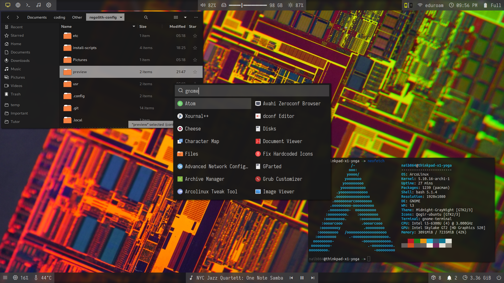

# regolith-config
Collection of files to get my regolith setup up and running.

i3 config in `.config/regolith/i3`  
polybar launch script in `.config/polybar/midnight/launch.sh`

# Installation

Everything is made under the assumption you are running a fresh install of Arcolinux-i3, as that is my OS of choice. The scripts will work with barebone Arch as well (to some degree, you will have to edit the pacman commands and remove all arcolinux packages)

After installation of the OS, do the following:

`mkdir temp && cd temp`   

`git clone https://github.com/naib864/regolith-config`

`./regolith-config/install-scripts/install.sh`

This will install the regolith-de with my configs and the themes I used from the sources stated below.
Sddm will replace lightdm, betterlockscreen will be put in place of the gnome-flashback screensaver, polybar will replace i3-bar.

# Credits

## Polybar files

The polybar config mostly comes from [adi1090x's polybar themes](https://github.com/adi1090x/polybar-themes) and is based on the grayblocks style there. Modified everything to suit my needs.

### Additional polybar modules
[Spotify](https://github.com/mihirlad55/polybar-spotify-module)  
[KDEConnect](https://github.com/haideralipunjabi/polybar-kdeconnect)

## GTK theme
[Midnight-GrayNight](https://github.com/i-mint/midnight/tree/master/Midnight-GrayNight) (Modified to remove rounded corners to better fit my style)

## SDDM theme

[Chili](https://github.com/MarianArlt/sddm-chili) (changed the wallpaper in the assets folder)

## Icon pack
[Qogir Icons](https://github.com/vinceliuice/Qogir-icon-theme/)

## Wallpaper
[Intel Itanium Die shots](https://www.youtube.com/watch?v=Lqz5ZtiCmYk) (Link to the pictures in the first comment of the youtube video)

## Fonts
[Material Design Icons](https://github.com/Templarian/MaterialDesign-Webfont): `apt install fonts-materialdesignicons-webfont` (ships with regolith by default)
For Arch: `yay -S ttf-material-design-icons-webfont`  

[Iosevka Nerd Font](https://github.com/ryanoasis/nerd-fonts/tree/master/patched-fonts/Iosevka)  
[Feather Icons](https://feathericons.com/)
